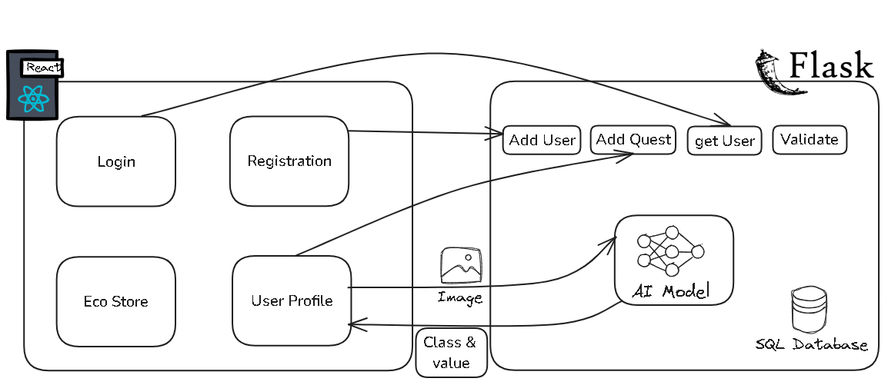
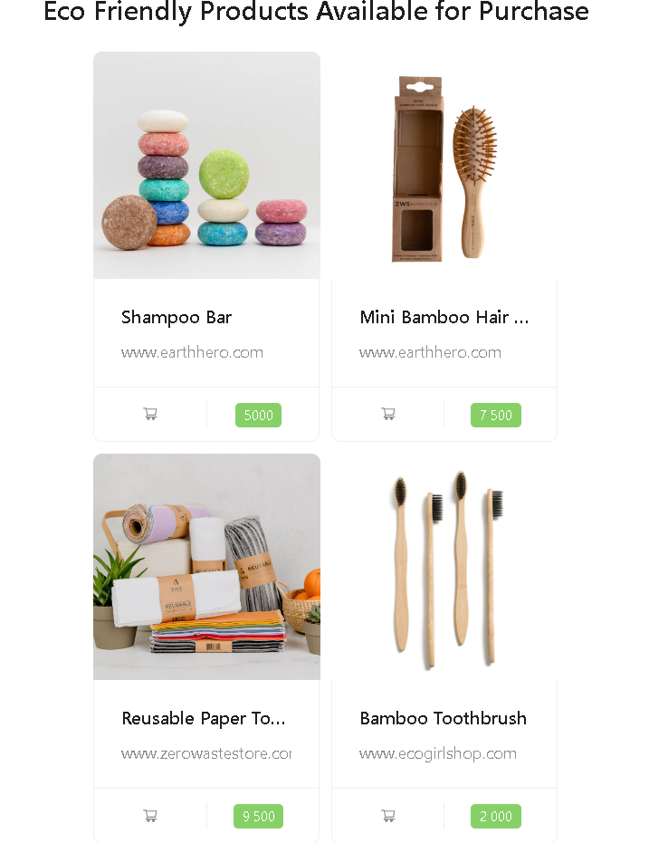

#### reVert
# Project Overview

Welcome to Revert, a Recycling Platform powered by AI! This platform allows users to:

- Create an account and log in.
- Scan products they want to recycle.
- Use an AI model to classify products into categories (Plastic, Metal, Paper, Glass).
- Earn coins based on the classification of recycled items.
- Use earned coins to buy eco-friendly products from an integrated store.
- Track their earnings and environmental impact.

Our mission is to encourage recycling by rewarding users for their contributions to a greener planet.


# Tech Stack

This project is built using the following technologies:

## Frontend

- **React:** A JavaScript library for building user interfaces.

## Backend

- **Flask:** A micro web framework written in Python.

## AI Models

- **GPT-4O Vision Model:** Used for classifying items into categories (Plastic, Metal, Paper, Glass).
- **RAG Model:** Utilized for estimating the equivalent points based on the classification and input.

## Pipeline Diagram

The following diagram explains the full pipeline of the project:



# Usage

## Register

To start using the platform, users need to register by providing the following information:

- Username
- Password
- Phone number
- Address


## Login

Once registered, users can log in to their accounts using their username and password.


## Dashboard

After logging in, users will be taken to their dashboard. The dashboard displays information about their recent activities, including:

- Items scanned
- Coins earned
- Environmental impact


## New Quest

To recycle items, users can initiate a new quest:

1. Scan the items they want to recycle using the platform.
2. The AI model will classify the items and assign them a value in coins.
3. Users can accept a deal to have an agent come to their house to collect the items.


## Store

Users can use the coins they've earned to buy eco-friendly products from the integrated store. The store offers a variety of products that promote a sustainable lifestyle.



# Installation

Follow these steps to set up the project locally:

## Prerequisites

Make sure you have the following installed on your machine:

- Python 3.x
- Node.js
- npm or yarn

## Backend Setup

1. **Clone the repository:**

   ```bash
   git clone https://github.com/omvriio/revert.git
   cd recycling-platform
   ```

2. **Create a virtual environment and activate it:**

   ```bash
   python -m venv venv
   source venv/bin/activate   # On Windows, use `venv\Scripts\activate`
   ```

3. **Install the backend dependencies:**

   ```bash
   pip install -r requirements.txt
   ```

4. **Run the backend server:**
   ```bash
   flask run
   ```

## Frontend Setup

1. **Navigate to the frontend directory:**

   ```bash
   cd frontend
   ```

2. **Install the frontend dependencies:**

   ```bash
   npm install   # or `yarn install` if you're using yarn
   ```

3. **Start the frontend development server:**
   ```bash
   npm start     # or `yarn start` if you're using yarn
   ```

# AI Model Integration

Our platform leverages advanced AI models to classify recycled items and estimate their equivalent points. Below is a detailed explanation of the AI models used:

## GPT-4O Vision Model

The GPT-4O Vision Model is used to classify the scanned items into one of the four categories:

- Plastic
- Metal
- Paper
- Glass

## RAG Model

The RAG (Retrieval-Augmented Generation) model is utilized to estimate the equivalent points based on the classification and input data. The RAG model combines the classification output with a knowledge base to provide an accurate estimation of points.

## Pipeline Explanation

The diagram below explains the full pipeline of the AI model integration:


1. **Input:** The user provides an image of the waste item.
2. **Classifier:**
   - **Prompt Engineering:** The input image is processed.
   - **GPT-4O Vision Model:** The vision model classifies the item and provides structured output.
3. **Evaluator:**
   - **Extracting an Optimized Query:** The classification output is used to create an optimized query.
   - **Similarity Search:** The query is matched with a knowledge base.
   - **Augmented Large Multimodal Model:** The matched information is used to estimate recyclability and the quantity of material/unit.
4. **Outputs:**
   - **Estimated Value in Points:** The model provides an estimated value in points.
   - **Class:** The classified category of the item.

This AI-driven approach ensures accurate classification and fair valuation of recycled items, encouraging users to participate in eco-friendly activities.

# Contact

For any inquiries or support, please reach out to us through our GitHub profiles:

- **Omar MARGHADI:** [GitHub Profile](https://github.com/omvriio)
- **Mohamed BACHAR:** [GitHub Profile](https://github.com/moebachar)
- **Noureddine SAIDI:** [GitHub Profile](https://github.com/ITSAIDI)

We are happy to assist you with any questions or feedback regarding the platform.
